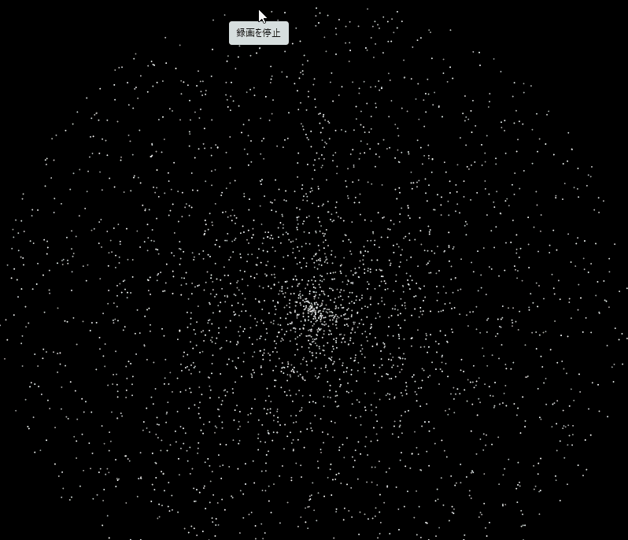

# 課題タイトル
銀河のような動きをするアニメーション

---

## 学籍番号・氏名
- 学籍番号：2501006
- 氏名：加藤幸輝

---

## 課題概要
- どのような課題か簡潔に説明：
  例：中心に近くなるほど回転が遅くなる銀河のようなアニメーションを作成しました。

---

## 使用技術・ライブラリ
- 使用言語：Processing (Java)
- 使用ライブラリ：
  なし

---

## 制作の工夫ポイント
- 実装や表現で工夫した点：
  - 中心に近づくにつれ、回転が徐々に遅くなるようにしました。

---

## 難しかった点・学んだこと
- 実装で苦労したこと：
  ひとつひとつのプログラムがどのように動くかや、調整に少し苦労しました。  
- この課題を通して学んだこと：
　processingの使用方法や、ひとつひとつの動き、
　プログラムを作成することが簡単ではないということを学びました。

---

## 今後の改善・発展アイデア
- 次に取り組むとしたら改善したい点：
  色を付け足したり、よりリアルな動きになるようにしたいです。
- 発展アイデアや追加機能：
  ボタンをクリックすることによって、色や動きが変化するようにしたいです。

---

## 実行方法
- Processingで開く場合：
  1. `sketchフォルダ` を開く
  2. `paiza_.pde` を開き「実行」ボタンを押す
---

## スクリーンショット / GIF

